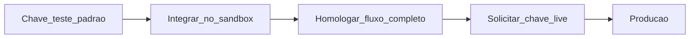

# Ambientes

Toda integração deve **começar no sandbox** e só ir para produção após homologação completa.

::: info Status
Deploy separado de sandbox com URLs dedicadas é **previsto**. Hoje o desenvolvimento local usa um único ambiente com Stripe test e e-mail em log-only. Veja [Status de implementação](/referencia/status-implementacao).
:::

## Dois ambientes

| | Sandbox (teste) | Produção (live) |
|---|-----------------|-----------------|
| **Propósito** | Desenvolver e homologar integrações | Operar com clientes reais |
| **URL base (exemplo)** | <DevApi field="base-url" env="test" /> | <DevApi field="base-url" env="live" /> |
| **Prefixo de chave** | <DevApi field="prefix" env="test" /> | <DevApi field="prefix" env="live" /> |
| **Banco de dados** | Isolado — sem dados de clientes reais | Dados de produção |
| **Stripe** | Modo **test** (`sk_test_`, `pk_test_`) | Modo **live** |
| **E-mail transacional** | Log-only ou caixa de teste | Microsoft Graph / envio real |
| **Honorários cobrados** | Pagamentos fictícios (cartões de teste Stripe) | Cobrança real |

URLs finais serão confirmadas no deploy. Em desenvolvimento local, a API costuma responder em <DevApi field="base-url" env="local" />.

## Regra de acoplamento chave ↔ ambiente

Esta regra é **obrigatória** no modelo alvo:

- Chave <DevApi field="prefix-wildcard" env="test" /> **só** é aceita no sandbox
- Chave <DevApi field="prefix-wildcard" env="live" /> **só** é aceita em produção

Requisição com chave no ambiente errado retorna `401 Unauthorized`. Isso evita criar contrato real ou disparar e-mail a titular durante testes.

## O que muda entre ambientes

### Dados

No sandbox, contratos, anexos e titulares são fictícios ou descartáveis. Não reutilize IDs de produção em scripts de teste.

### Pagamentos

- **Sandbox:** use cartões de teste Stripe; webhook aponta para endpoint de homologação
- **Produção:** PaymentIntent/Checkout real; webhook com `whsec` de produção

O honorário do contrato (`Fees`) segue a mesma [precificação](/precificacao/) — muda só se o pagamento é real ou simulado.

### E-mail e portal

- **Sandbox:** links de portal podem ser gerados, mas e-mails não devem ir para caixas reais de clientes
- **Produção:** após ativação, e-mail com link `/portal/c/{token}` quando houver e-mail do beneficiário

### OpenAPI

Em desenvolvimento local, a especificação está em `/openapi/v1.json` (Swagger UI na API). Publicação estável por ambiente: **previsto**.

## Fluxo recomendado

1. Usar a chave de teste **padrão** (par público/privado provisionado no cadastro, acesso ilimitado) — [Criar chave API](/desenvolvedores/criar-chave-api#chave-de-teste-padrao-automatica)
2. Integrar listagem, cotação, cadastro, anexos e share-portal no sandbox — [Primeiros passos](/desenvolvedores/primeiros-passos)
3. Validar pagamento com Stripe test e webhook de homologação
4. Criar chave **<DevApi field="prefix-wildcard" env="live" />** com perfil **Owner** (confirmação consciente de acesso a dados reais)
5. Trocar base URL e credenciais Stripe para produção
6. Monitorar rate limits e erros nos primeiros dias

## Desenvolvimento local

Para o time Anexus, o ambiente local combina:

- API em <DevApi field="host" env="local" />
- Frontend em `localhost:5173` (proxy `/api` → API)
- Stripe: `stripe listen --forward-to http://localhost:5186/api/stripe/webhook`
- E-mail: log-only quando OAuth Graph não está configurado

Isso **não substitui** o sandbox deployado — é ambiente de engenharia interna.

## Próximo

- [Criar chave API](/desenvolvedores/criar-chave-api)
- [Preços e limites](/desenvolvedores/precos-e-limites)
- [Primeiros passos](/desenvolvedores/primeiros-passos)

[← Voltar a Desenvolvedores](/desenvolvedores/)
