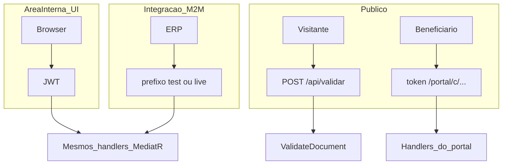

# Autenticação

A Anexus usa **credenciais diferentes** conforme quem chama a API. Não há um único tipo de autenticação para todos os casos.

::: info Status
Chaves de API (<DevApi field="prefix-wildcard" env="test" /> / <DevApi field="prefix-wildcard" env="live" />) e autorização por escopos são **previstos**. Hoje a área interna usa JWT com políticas de tela (`screens.*`). Veja [Status de implementação](/referencia/status-implementacao).
:::

## Visão geral



## Quatro superfícies

| Superfície | Mecanismo | Quem usa |
|------------|-----------|----------|
| **Área interna (UI)** | JWT (`login` → `Bearer` + refresh) | Operadores humanos no navegador |
| **API de integração** | Chave de API (<DevApi field="prefix-wildcard" env="test" /> / <DevApi field="prefix-wildcard" env="live" />) | Servidores, ERP, scripts backend |
| **Portal do beneficiário** | Token opaco no link (`/portal/c/{token}`) | Contratante e beneficiário |
| **Validador público** | Nenhuma (rate limit por IP) | Qualquer visitante em `/validar` |

## JWT — sessão humana

Fluxo atual da interface web:

1. `POST /api/auth/login` ou `register` → tokens de acesso e refresh
2. Requisições autenticadas com `Authorization: Bearer {accessToken}`
3. Renovação via `POST /api/auth/refresh`

O JWT carrega `userId`, `tenantId` e perfil (`Owner`, `Operator`, `Billing`). A autorização na UI usa políticas de **tela** (`screens.home`, `screens.contracts`, `screens.settings`).

**Uso correto:** navegador e apps onde o operador faz login interativo.

**Não use** JWT em scripts de longa duração ou integrações servidor-a-servidor — prefira chave de API quando disponível.

## Chaves de API — integração M2M

Credencial de **longa duração** para aplicações backend:

```http
Authorization: Bearer {{api.key.test.sample}}
```

| Propriedade | Regra |
|-------------|-------|
| **Dono** | Tenant (organização), não o usuário humano |
| **Criação** | Chave de teste **padrão** no cadastro do tenant; chaves adicionais de **teste** por usuário com **perfil verificado** e acesso a Configurações; chaves **live** somente por **Owner** |
| **Ambiente** | <DevApi field="prefix-wildcard" env="test" /> só no sandbox; <DevApi field="prefix-wildcard" env="live" /> só em produção |
| **Permissões** | Chave **padrão de teste**: todos os escopos v1 automaticamente. Chaves **adicionais**: [escopos](/desenvolvedores/escopos) explícitos na criação |
| **Armazenamento** | Hash no servidor; segredo exibido uma vez na criação |

O middleware resolve o tenant a partir da chave (equivalente ao claim `tenantId` do JWT). Os mesmos handlers MediatR atendem UI e API — muda só como o contexto é preenchido.

::: warning
**Nunca use chave de API no navegador.** Segredos em JavaScript, localStorage ou apps mobile expostos equivalem a vazamento permanente. A UI continua com JWT.
:::

Detalhes operacionais: [Criar chave API](/desenvolvedores/criar-chave-api) e [Ambientes](/desenvolvedores/ambientes).

## Portal — token de link

O beneficiário acessa `GET /portal/c/{token}` (via método `QUERY` na API) **sem** login nem API key. O token é opaco, gerado ao compartilhar o portal (`share-portal`).

- Download de documentos: token + `documentId`
- Solicitação LGPD: `POST /api/portal/lgpd` (público, corpo com dados do titular)

Integradores **geram** o link via API (`contracts:portal`); o beneficiário **consome** o link diretamente.

## Validador — anônimo

`POST /api/validar` aceita PDF multipart sem credencial. Rate limit por IP protege abuso.

Possível evolução comercial em escala (volume alto) — ver [Preços e limites](/desenvolvedores/precos-e-limites).

## Resolução de tenant

| Auth | Como o tenant é definido |
|------|--------------------------|
| JWT | Claim `tenantId` no token + `TenantResolutionMiddleware` |
| API key | Lookup da chave → `tenant_id` associado |
| Portal | Token → contrato → tenant do contrato (filtros ignorados onde necessário) |
| Anônimo | Sem tenant (validador) ou conforme regra do endpoint |

## Escolha rápida

| Preciso… | Use |
|----------|-----|
| Automatizar cadastro de contratos no ERP | Chave de API + escopos `contracts:*` |
| Operador usando o app no browser | JWT (login normal) |
| Beneficiário ver andamento | Link do portal (sem API key) |
| Validar PDF publicamente | `POST /validar` (sem credencial) |
| Receber confirmação de pagamento Stripe | Webhook Stripe (assinatura HMAC, não API key) |

## Próximo

- [Ambientes](/desenvolvedores/ambientes) — sandbox vs produção
- [Escopos](/desenvolvedores/escopos) — catálogo de permissões v1
- [Convenções](/desenvolvedores/convencoes) — headers e formato HTTP

[← Voltar a Desenvolvedores](/desenvolvedores/)
