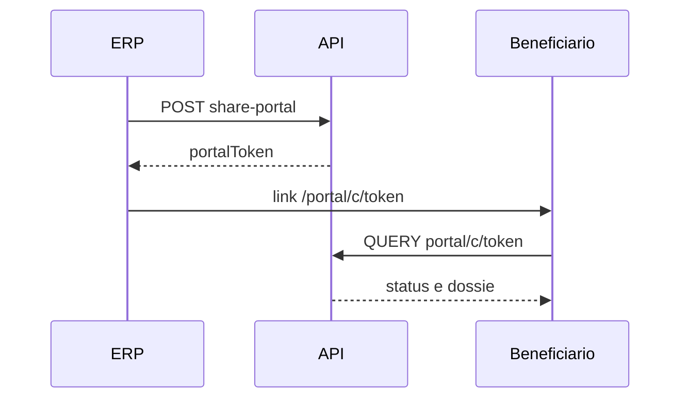

# Referência — Portal

Base: `/api/portal`. Experiência do usuário: [Portal](/telas/portal/).

**Não usa API key.** O beneficiário acessa com **token opaco** no link gerado por `share-portal`.

Auth: `AllowAnonymous` — autorização via token na rota ou corpo.

## Consultar contrato

```http
QUERY /api/portal/c/{token}
```

Corpo: `{}`

Retorna `PortalContractDto`: etapas, dossiê resumido, documentos disponíveis para download.

| Item | Valor |
|------|-------|
| Quem obtém o token | Integrador com `contracts:portal` ou operador na UI |
| Status | **entregue** |

URL pública (frontend):

`/portal/c/{token}`

## Download de documento

```http
QUERY /api/portal/c/{token}/documents/{documentId}
```

Corpo: `{}`

Retorna arquivo binário (`Content-Disposition`).

| Item | Valor |
|------|-------|
| Status | **entregue** |
| Nota | Prévia inválida antes da baixa — [Assinatura](/dominios/contratos-assinatura) |

## Solicitação LGPD

```http
POST /api/portal/lgpd
```

Corpo:

```json
{
  "name": "Titular Exemplo",
  "email": "titular@exemplo.test",
  "type": "Access",
  "message": "Solicito cópia dos dados tratados."
}
```

Resposta: `204 No Content`. Encaminhamento ao controlador via outbox — [Privacidade](/privacidade/).

| Item | Valor |
|------|-------|
| Auth | Anônimo (dados do titular no corpo) |
| Status | **entregue** |

## Integração típica



## Próximo

- [Referência — Contratos](/desenvolvedores/referencia/contratos) — `share-portal`
- [Autenticação](/desenvolvedores/autenticacao)
- [Fixtures do portal](/referencia/fixtures-portal) — tokens de demo

[← Referência da API](/desenvolvedores/referencia/)
