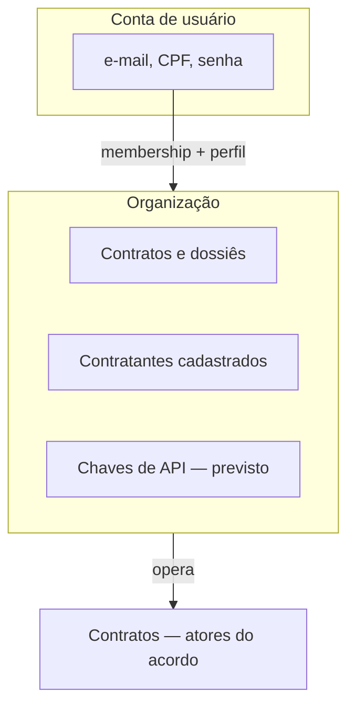

# Organização

A **organização** é o espaço de trabalho na área interna onde contratos, clientes cadastrados e integrações ficam agrupados e isolados. Cada organização enxerga **apenas os próprios** contratos e dados operacionais.

Na API e no backend, o mesmo conceito aparece como **tenant**. Neste Guia usamos **organização**.

::: info Status
Auto-cadastro cria organização pessoal com perfil **Dono**. A área interna oferece troca de organização, gestão de membros (cadastro de funcionário com senha temporária ou **convite por link**) e troca obrigatória de senha no primeiro acesso — [Status de implementação](/referencia/status-implementacao).
:::

## Para que serve

| Função | Efeito |
|--------|--------|
| **Agrupar o trabalho** | Contratos, contratantes cadastrados e arquivos do dossiê pertencem a uma organização |
| **Isolar dados** | Uma organização não acessa contratos ou clientes de outra |
| **Integrar sistemas** | Chaves de API (**previsto**) identificam a organização, não o usuário humano |

Quem opera na área interna age **dentro** de uma organização. O [Portal](/telas/portal/) e o validador público entram pelo contrato ou pelo link — não “pertencem” à organização do beneficiário da mesma forma.

## Organização ≠ atores do contrato

Os [atores](atores) descrevem quem participa de **um contrato**. A organização descreve **onde** o operador trabalha na plataforma.

| | Organização | [Contratante](atores-contratante) | [Beneficiário](atores-beneficiario) |
|---|-------------|-----------------------------------|-------------------------------------|
| **O que é** | Espaço de operação na área interna | Cliente do acordo | Titular do serviço |
| **Login na área interna?** | Membros sim | Não (salvo coincidir com o operador) | Não |
| **Portal?** | Não | Não | Sim |
| **Dono dos contratos no sistema?** | Sim (limite de dados) | Parte do contrato | Dados do caso |

A organização **opera** contratos; o contratante **participa** do contrato. Não confundir cliente cadastrado (contratante) com a organização que presta o serviço.

## Conta de usuário e organização

Duas camadas distintas:

- **Conta de usuário** — a pessoa que faz login (e-mail, CPF, senha).
- **Organização** — o espaço onde o trabalho acontece; contratos e arquivos ficam ligados a ela.
- **Membership** — vínculo entre conta e organização, com um **perfil** (abaixo).

**Hoje:** no cadastro nasce uma **organização pessoal** e a conta entra como **Dono**. É possível **criar outra organização**, **trocar o contexto ativo** no menu do usuário e, como Dono, **cadastrar funcionários** em Configurações → Organização (senha temporária + troca no primeiro login) ou **enviar convite por link** para quem já tem (ou criará) conta com o mesmo e-mail.

## Convite por link

Alternativa ao cadastro direto com senha temporária:

| Etapa | Quem | O que acontece |
|-------|------|----------------|
| **Enviar** | Dono | Informa e-mail e perfil; a Anexus envia link válido por 7 dias |
| **Aceitar** | Convidado | Abre o link, entra (ou cria conta) com o **mesmo e-mail** e aceita |
| **Entrar** | Convidado | Passa a ser membro da organização; o contexto ativo muda para ela |

O provisionamento com senha temporária continua sendo o fluxo principal para funcionários novos sem conta. O convite evita senha temporária quando a pessoa já usa a Anexus ou prefere definir a própria senha no cadastro.

## Perfis na organização

O perfil define **o que a conta pode fazer na área interna** daquela organização. Não é papel no contrato nem papel na LGPD.

| Perfil | Área interna hoje | Observação |
|--------|-------------------|------------|
| **Dono** | Início, contratos, configurações | Referência operacional da organização; e-mail usado em fluxos LGPD quando aplicável |
| **Operador** | Início e contratos | Operação do dia a dia; sem configurações |
| **Cobrança** | Início e configurações | Pagamentos e configurações; sem lista de contratos |

Quem está logado continua sendo **controlador** dos dados do caso — independentemente do perfil na organização. O perfil restringe telas e ações; não transfere a responsabilidade LGPD para a organização como entidade. Detalhes: [Papéis no tratamento](/privacidade/papeis).

## O que pertence à organização

- Contratos e números de serviço
- Contratantes cadastrados na área interna
- Arquivos do dossiê (storage isolado por organização)
- Chaves de API — **previsto**; [Criar chave API](/desenvolvedores/criar-chave-api)

Cada contrato pertence a **uma** organização. O [beneficiário](atores-beneficiario) acessa o andamento pelo link do portal, sem conta na organização.

## Relação com os outros domínios

- **[Atores](atores)** — quem assina, opera ou acompanha **no contrato**
- **[Contratos](contratos)** — pedido, assinatura, dossiê e progresso **dentro** da organização
- **[Plataforma](/plataforma)** — missão e pilares da Anexus como operadora
- **[Autenticação](/desenvolvedores/autenticacao)** — como o contexto da organização chega ao JWT e à API (Desenvolvedores)